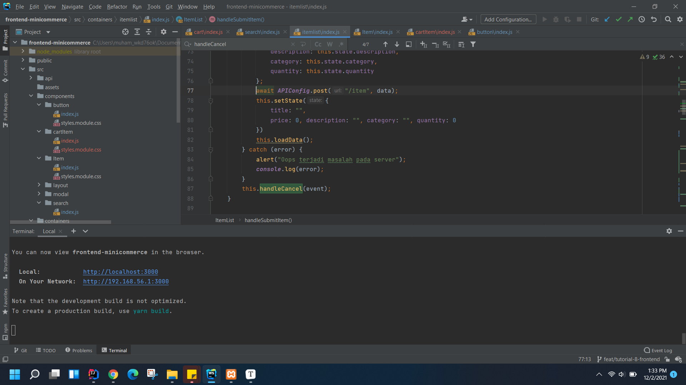
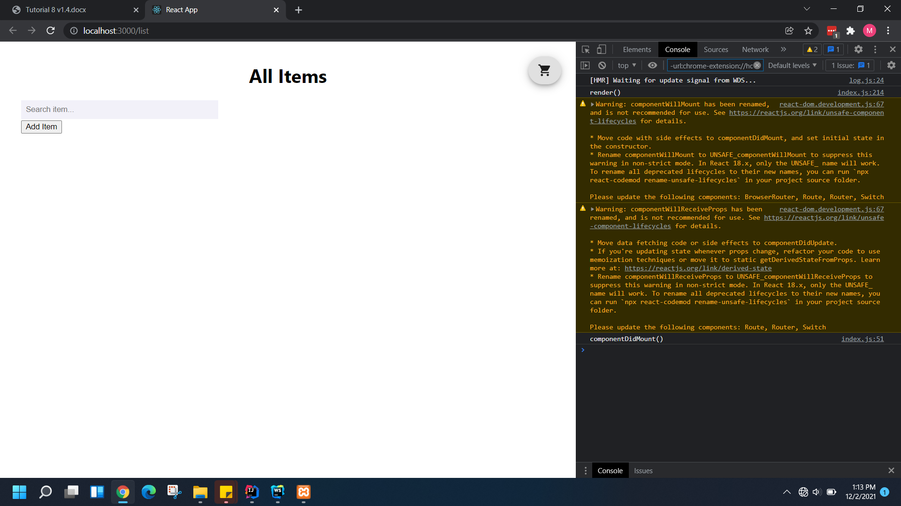
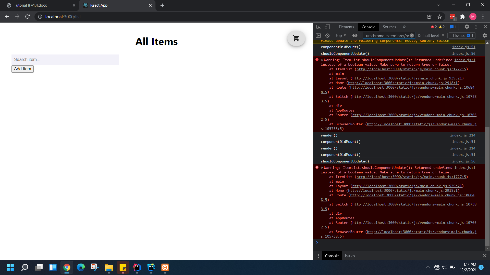
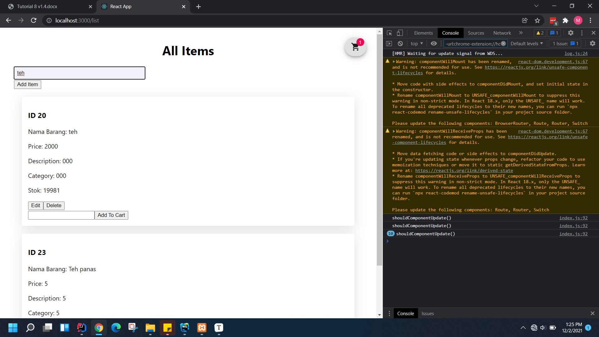
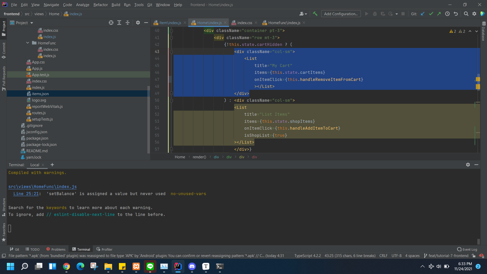
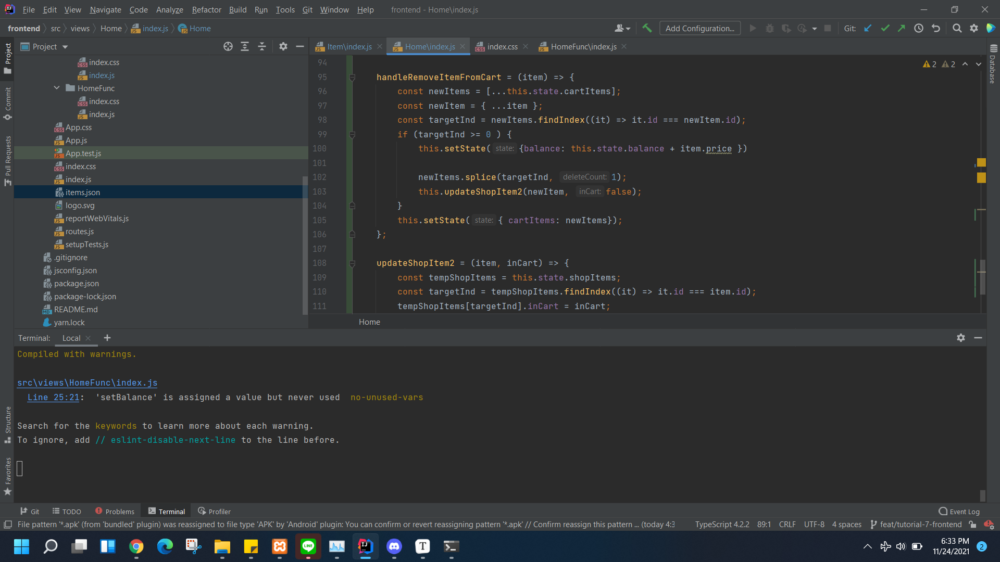
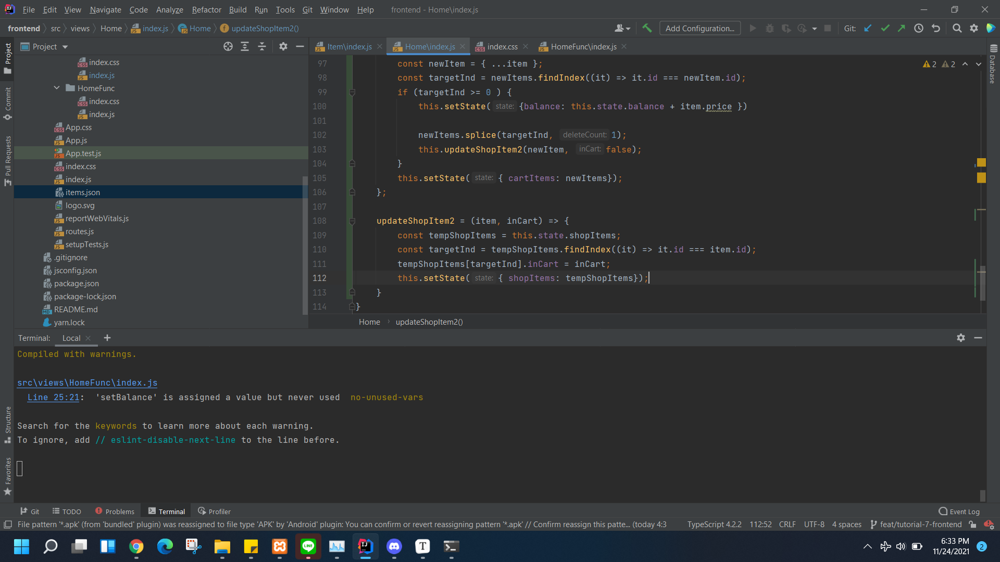

# Tutorial Arsitektur & Pemrograman Aplikasi Perusahaan

Semua pdf tutorial dapat diakses pada https://drive.google.com/drive/folders/13l2XdyIxJ6pGuPUnMKyeftr2M608TI8z?usp=sharing

## Authors
* **Muhammad Ichsanul Amal** - *1906353454* - *A*

---

## Tutorial 8

**1. Ceritakan langkah - langkah yang kalian lakukan untuk solve LATIHAN no.1, dan mengapa kalian melakukan langkah - langkah tersebut?**

Pada saat saya mengerjakan, setelah form diisi, modal akan otomatis tercancel dan setelah dibuka kembali form isian sudah secara otomatis seperti belum diisi. Alasannya adalah karena baris berikut dimana state dari formnya dijadikan kosong, dan langsung dilakukan pemanggilan fungsi handleCancel. Dengan demikian, untuk menghandle untuk fungsi edit item juga, baris pada 78 hanya perlu dipindahkan ke fungsi handleCancel;



**2. Jelaskan fungsi dari async dan await!**

- **async** digunakan untuk mengubah function menjadi asynchronous, yang merupakan salah satu cara untuk mengatasai masalah asynchronous pada Javascript. Async berfungsi untuk secara otomatis mengembalikan sebuah return value berupa objek dengan bentuk/tipe Promise, atau ditolak dengan uncaught errors dan dapat menggunakan keyword await.

- Sementara **await** berfungsi untuk memberi tahu program untuk keluar secara sementara dari fungsi async dan melanjutkan programnya ketika tugas yang diberikan telah selesai. Hal ini berarti baris berikutnya belum dieksekusi sebelum baris yang menggunakan await telah selesai dieksekusi. Fungsi await hanya dapat digunakan pada fungsi yang menggunakan async. 

**3. Masukkan jawaban dari Screenshot yang diperintahkan di halaman 7 pada Component Lifecycle pada pertanyaan ini.**

Saya tidak sempat screenshoot pada saat mengerjakan, sehingga saya hanya comment dan uncomment dari hal yang telah saya lakukan. Berikut SS nya, tidak ada shouldComponentUpdate sebelum dilakukan apa-apa.



Berikut setelah dilakukan bind, dan button add item diklik, serta tidak ditambahkan return value pada shouldComponentUpdate.



Berikut setelah ditambahkan return value dan dilakukan event pada beberapa komponen yang mengubah property atau state.




**4. Jelaskan fungsi dari componentDidMount, shouldComponentUpdate, componentDidUpdate, componentWillReceiveProps, componentWillUnmount. Notes : Penjelasan harus mencantumkan “kapan fungsi dipanggil” dan “use case apa saja yang biasanya menggunakan lifecycle method tersebut”.**

**componentDidMount:**

- merupakan salah satu component Lifecycle yang biasanya digunakan untuk melakukan pengambilan data dan menandakan tahap akhir dari mounting lifecycle, fungsi ini dipanggil setelah HTML yang dirender telah selesai melakukan loading. Fungsi ini dapat digunakan saat React ingin mengambil data dari aplikasi eksternal seperti API dari website lain atau framework JavaScript. Setelah itu kita dapat menggunakan method setState() untuk memperbarui data yang didapat dan melakukan rendering dengan data yang baru.
- Use case: Mengambil data (API) dari website lain untuk kemudian dirender.

**shouldComponentUpdate:**

- Merupakan salah satu component Lifecycle yang biasanya digunakan untuk menentukan apakah perubahan yang terjadi di component akan ditampilkan atau tidak. Seperti memberitahu React jika output dari komponen tidak terpengaruh oleh perubahan saat ini di dalam state dan props. Dengan kata lain, fungsi ini memberi tahu bahwa apakah komponen harus diperbarui atau tidak, dengan return value berupa boolean true yang berarti program akan merender ulang component yang telah diubah yang secara otomatis akan terupdate atau false untuk component yang tidak merender ulang dalam arti tidak ada component yang diubah dan dengan menerima parameter nextProps dan nextState. Fungsi ini akan dijalankan setelah props atau state dari component tersebut mengalami perubahan tetapi sebelum proses rendering dimulai.
- Use case: Ingin mengubah komponen dan melakukan rendering kembali pada setiap state yang berubah.

**componentDidUpdate:**

- merupakan salah satu component Lifecycle yang biasanya digunakan pada saat melakukan interaksi dengan environment non-React seperti browser atau API. Fungsi ini akan dijalankan Saat suatu instance di dalam suatu komponen melakukan update dan ketika HTML yang dirender telah selesai melakukan loading.
- Use case: Melakukan update pada komponen 

**componentWillReceiveProps:**

- merupakan salah satu component Lifecylce yang memungkinkan perubahan state berdasar pada props yang sekarang dan props baru, dengan begitu kita dapat mengetahui apakah terdapat perubahan pada props atau tidak, tanpa melakukan render kembali. Dengan kata lain, fungsi tersebut dapat memberi tahu React bahwa akan ada perubahan pada komponen yang memiliki props. Fungsi ini akan dijalankan ketika terjadi perubahan pada props sebelum component di render. Method ini hanya akan dipanggil saat komponen akan menerima props.
- Use case: Melakukan reset state. 

**componentWillUnmount:**

- merupakan salah satu component Lifecycle yang berguna ketika ada action yang berhubungan dengan cleanup diperlukan seperti melakukan pembersihan timer yang tidak valid, membatalkan permintaan jaringan, atau membersihkan langganan apa pun yang dibuat di componentDidMount. Oleh karena itu, fungsi ini akan dijalankan ketika ada component yang telah dihapus dari DOM, misalnya ketika DOM dirender ulang tanpa komponen atau pengguna berganti website atau menutup browsernya. 
- Use case: Menghapus interval waktu fungsi berjalan.

## **Tutorial 7**

**1. Jelaskan apa yang Anda lakukan di latihan dalam satu paragraf per-soal. Berikan screenshot sebagai ilustrasi dari apa yang Anda jelaskan**

- Pertama tambahkan fungsi untuk menghandle click.



- Selanjutnya carilah index item pada cartItems. Apabila index ditemukan, maka state dari balance ditambahkan dengan price dari item yang dipilih. Gunakan fungsi slice untuk menghapus item dari array berdasarkan index item yang sudah didapat. Kemudian, update state dari cartItems. Update state juga dari shopItems agar tombol add to cart muncul kembali.





**2. Menurut pemahaman kamu selama pengerjaan tutorial ini, apa perbedaan antara state dan props?**

- Props merupakan singkatan dari property yang setara dengan argumen pada sebuah function di bahasa pemrograman seperti java atau python. Pada umumnya, props digunakan untuk melakukan komunikasi data antar component dari parent component ke child component.

- Sedangkan state adalah data private yang dimiliki component yang terus berubah sesuai dengan perilaku program atau bersifat dinamis. State digunakan untuk komunikasi data internal atau manipulasi object saat itu juga.

**3. Menurut kamu, apakah sebaiknya kita menggunakan component (e.g. List, Item) dalam React? sebutkan alasannya.**

- Ya, karena React memang dedesain seperti itu agar kita menggunakan component sehingga dapat di reuse. Setiap component,seperti pada tutorial yaitu Item dan List memiliki logika sendiri dan mengontrol proses renderingnya sendiri. Jika kita menggunakan fitur komponen, kita dapat menggunakan kode yang terdapat didalamnya kapan saja dan dimana saja dan dapat membantu kita dalam membuat aplikasi yang konsisten.

**4. Apa perbedaan class component dan functional component?**

- Functional components lebih ringkas struktur kodenya. Namun, Functional component hanya bisa menggunakan `props` itu sebabnya function component disebut ***stateless component*** atau biasa digunakan juga sebagai ***UI Component*** (komponen yang menangani tampilan). Sedangkan Class component dapat menggunakan `state` dan `props`.

**5. Dalam react, apakah perbedaan component dan element?**

- Elemen adalah blok bangunan terkecil di React, yang menggambarkan apa yang akan dilihat oleh user di layar mereka. Secara sederhana, elemen dapat didefinisikan sebagai representasi virtual dari DOM. Sedangkan Komponen pada React menerima input yang disebut *props* dan me-*return React Element* yang menggambarkan apa yang akan ditampilkan di layar. Komponen memungkinkan kita untuk membuat UI yang *independent, isolated,* dan *reusable* sehingga mengurangi repetisi kode. Secara kasar, element dapat merupakan instance dari component yang telah dibuat.

Bonus jawaban, Kelebihan dan Kekurangan React:

- Mudah untuk dipelajari dan implementasikan terlebih jika sudah memahami programming, dapat menjadikan pembuatan aplikasi web dinamis menjadi lebih mudah, proses rendering yang lebih cepat karena terdapat virtual DOM, populer atau banyak digunakan oleh perusahaan, terdapat developer toolset yang sangat membantu seperti React Dev Tools pada browser, dan lainnya.

- Ukuran library yang besar, sulitnya memahami flow dan juga bahasa pemrograman yang digunakan pada react jika belum pernah memiliki pengalaman programming sebelumnya sehingga butuh pelatihan yang cukup intensif, hanya mencakup lapisan UI aplikasi dan tidak ada yang lain (frontend), dan menurut saya javascript tidak type-safe sehingga terkadang tipe data dari objeknya membingungkan, dan hanya bisa dilihat dari namanya dan tes secara manual saja.

## Tutorial 6

1. **Jelaskan secara singkat perbedaan Otentikasi dan Otorisasi! Di bagian mana (dalam kode yang telah anda buat) konsep tersebut diimplementasi?**

- Otentikasi merupakan proses untuk melakukan verifikasi apakah pengguna yang ingin login dengan username tersebut telah terdaftar di database dan berhak untuk masuk dan mengakses aplikasi. Biasanya melibatkan username dan password, tetapi dapat menyertakan metode lain yang dapat menunjukkan identitas seperti sidik jari.

- Berikut merupakan contoh implementasi otentifikasi pada class `WebSecurityConfig`: @Autowired public void configAuthentication(AuthenticationManagerBuilder auth) throws Exception{auth.userDetailsService(userDetailsService).passwordEncode(encoder());}

- Otorisasi merupakan proses untuk menentukan hak pengguna apakah pengguna memiliki akses ke halaman tertentu yang telah diotentifikasi dan menentukan apakah orang yang sudah diidentifikasi (diotentikasi), diperbolehkan untuk memanipulasi sumber daya tertentu. Biasanya ditentukan dengan mencari apakah orang itu memiliki akses ke sumber daya tertentu.

- Berikut merupakan contoh implementasi otorisasi pada class 

  ```java
  .authorizeRequests()
                  .antMatchers("/css/**").permitAll()
                  .antMatchers("/js/**").permitAll()
                  .antMatchers("/user/viewall/**").hasAnyAuthority("Admin")
  ```

2. **Apa itu BCryptPasswordEncoder? Jelaskan secara singkat cara kerjanya!**

- BCryptPasswordEncoder merupakan salah satu fungsi password hashing. BCryptPasswordEncoder bertugas untuk melakukan enkripsi password user sebelum disimpan ke database. BCryptPasswordEncoder juga bertugas untuk melakukan encrypt terhadap password pada saat user ingin melakukan login. Cara kerjanya adalah saat membuat user baru dengan membuat username dan password baru, password akan dienkripsi menggunakan fungsi BCrypt sehingga password yang terlihat pada database adalah password yang sudah dienkripsi.

3. **Apakah penyimpanan password sebaiknya menggunakan encryption atau hashing? Mengapa demikian?**

- Hashing dan enkripsi keduanya menyediakan cara untuk menjaga keamanan data sensitif. Namun, penyimpanan password perlu dihash. Enkripsi adalah fungsi dua arah, artinya plaintext asli dapat diambil kembali. Enkripsi sesuai untuk menyimpan data seperti alamat pengguna karena data ini ditampilkan dalam teks biasa pada profil pengguna. Sedangkan Hashing adalah fungsi satu arah (yaitu, tidak mungkin untuk "mendekripsi" hash dan mendapatkan nilai aslinya) sehingga Hashing sesuai untuk validasi password.


4. **Jelaskan secara singkat apa itu UUID beserta penggunaannya!**

- UUID (Universally Unique Identifier) merupakan kode identifikasi unik yang diberikan oleh sistem secara acak dengan algoritma tertentu. UUID digunakan untuk memungkinkan sistem men-generate id pengguna secara unik dengan hashing sebanyak 32 karakter secara acak yang bertujuan untuk meningkatkan keamanan data pengguna sehingga id pengguna aman dan tidak mudah untuk diretas. Mirip seperti BCrypt, bedanya kali ini adalah ID, bukan password. Saat kita membuat user baru, sistem akan otomatis melakukan pemberian kode unik yang akan terlihat pada database dengan tipe UUID.

5. **Apa kegunaan class UserDetailsServiceImpl.java? Mengapa harus ada class tersebut ?**

- Class UserDetailsServiceImpl.java mengimplementasi interface UserDetailService yang sudah disediakan oleh spring security. Class tersebut berguna untuk mengambil informasi otentikasi dan otorisasi pengguna. Tujuannya agar Spring Boot Security dapat melakukan otorisasi terhadap pengguna yang melakukan login sesuai dengan rolenya yang sudah terdaftar di database. Class ini harus ada karena class UserServiceImpl dan RoleServiceImpl tidak dapat memberikan informasi kepada Spring boot mengenai otentikasi dan otorisasi dari akun-akun yang ada pada database sistem.


## Tutorial 5

1. **Apa itu Postman? Apa kegunaannya?** Postman adalah aplikasi atau development tool API yang digunakan untuk melakukan build, test, dan modify API. Postman berfungsi sebagai REST Client dimana dapat digunakan untuk uji REST API. Dengan Postman, kita sebagai developer dapat mendokumentasikan, tes, mendesain, debug, menerbitkan, dan memonitor API pada satu tempat. Developer tidak harus menulis HTTP client network code, tetapi membuat test suites yang dinamakan "Collections" ketika menggunakan Postman untuk melakukan testing. Postman akan berinteraksi dengan API secara otomatis.

2. **Jelaskan fungsi dari anotasi @JsonIgnoreProperties dan @JsonProperty.**

- @JsonIgnoreProperties berfungsi untuk memberikan perintah pada class untuk mengabaikan properti logis yang ditentukan dalam serialisasi dan deserialisasi JSON. Sebagai contoh, ketika kita memberikan true untuk element ignoreUnknown, maka field JSON akan diabaikan jika data JSON memiliki field yang tidak mempunyai properti logis.
- @JsonProperty merupakan anotasi yang memiliki fungsi untuk mengubah nama variabel. @JsonProperty memberitahu Jackson ObjectMapper untuk memetakan nama property JSON ke nama field Java yang diberikan anotasi.

3. **Apa kegunaan atribut WebClient?** WebClient yang digunakan pada RestServiceImpl merupakan sebuah interface yang disediakan oleh Spring Framework yang merupakan bagian dari reactive client. WebClient memiliki fungsi sebagai poin akses utama dari web / HTTP requests. Selain itu, WebClient juga berfungsi untuk menginstansiasi sebuah akses poin URL serta mengelola request dan response atas URL tersebut.

4. **Apa itu ResponseEntity dan BindingResult? Apa kegunaannya?**

- ResponseEntity merupakan salah satu class yang terdapat di java dan mewakili respons HTTP, termasuk header, body, dan status. Seperti @ResponseBody yang menempatkan return value ke body dari response, ResponseEntity juga memungkinkan kita untuk dapat menambahkan header dan kode status.
- BindingResult merupakan objek Spring yang menyimpan hasil dari validasi, binding, dan error atas model objek yang divalidasikan. BindingResult berisikan informasi mengenai kesalahan, seperti field yang diperlukan, adanya ketidakcocokan jenis atau kesalahan dalam melakukan pemanggilan method. BindingReslut digunakan dengan cara diletakkan setelah parameter objek validasi.

## Tutorial 4

1. Jelaskan perbedaan th:include dan th:replace! 

   Keduanya merupakan cara untuk memasukkan konten dari sebuah fragmen. Perbedaannya adalah, pada relace tagnya diganti dengan tag pada fragment, sedangkan pada include tidak.

   - contoh fragment

   ```
   <div th:fragment="targetFragmentToIncludeInOurPage" id="tagWithFragmentAttribute">
    <div id="contentGoesHere"></div>
   </div>
   ```

   - penggunaan pada div

   ```
   <div id="tagWithReplaceAttribute" th:replace="fragments/header :: targetFragmentToIncludeInOurPage"></div>
   <div id="tagWithInsertAttribute" th:insert="fragments/header :: targetFragmentToIncludeInOurPage"></div>
   <div id="tagWithIncludeAttribute" th:include="fragments/header :: targetFragmentToIncludeInOurPage"></div>
   ```

   - hasil

   ```
   <div id="tagWithFragmentAttribute">
    <div id="contentGoesHere"></div>
   </div>
   
   <div id="tagWithInsertAttribute">
    <div id="tagWithFragmentAttribute">
     <div id="contentGoesHere"></div>
    </div>
   </div>
   
   <div id="tagWithIncludeAttribute">
    <div id="contentGoesHere"></div>
    </div>
   ```

   

2. Jelaskan apa fungsi dari th:object! 

   th:object digunakan untuk menentukan objek yang akan dibound oleh data pada form yang dikirimkan

3. Jelaskan perbedaan dari * dan $ pada saat penggunaan th:object! Kapan harus dipakai?

   \* digunakan saat ingin mengambil nilai dari atribut pada th:object yang disebutkan, sedangkan cara mengambil nilai dari atribut menggunakan $ adalah dengan `${<nama_objek>.atribut}`. Atau secara singkat ${} berarti variable expressions sedangkan *{} selection variable expressions


---

## Tutorial 3

**1. Tolong jelaskan secara singkat apa kegunaan dari anotasi-anotasi yang ada pada model (@AllArgsConstructor, @NoArgsConstructor, @Setter, @Getter, @Entity, @Table)**

@AllArgsConstructor untuk menambahkan constructor secara otomatis dari class berdasarkan semua argumen, @NoArgsConstructor untuk menambahkan constructor secara otomatis dari class tanpa argumen, @Setter untuk menambahkan setter secara otomatis dari class, @Getter untuk menambahkan getter secara otomatis dari class, @Entity untuk merelasikan class dengan entitas atau table pada database, dan @Table untuk men-set nama table pada entity yang terhubung dengan class.

**2. Pada class CabangDB, terdapat method findByNoCabang, apakah kegunaan dari method tersebut?**

Method tersebut merupakan fitur dari JPA Repository, fungsinya adalah memudahkan dalam pencarian ke database berdasarkan NoCabang yang mana NoCabang merupakan atribut dari Cabang.

**3. Jelaskan perbedaan kegunaan dari anotasi @JoinTable dan @JoinColumn**

@JoinTable menyimpan id dari kedua tabel ke dalam tabel baru terpisah, sedangkan @JoinColumn menyimpan id dari tabel lain di kolom baru, bukan pada tabel baru.

**4. Pada class PegawaiModel, digunakan anotasi @JoinColumn pada atribut cabang, apa kegunaan dari name, referencedColumnName, dan nullable dalam anotasi tersebut? dan apa perbedaan nullable dan penggunaan anotasi @NotNull**

`name` adalah kolom atribut pada PegawaiModel yang berelasi dengan Model lainnya, `referencedColumnName` adalah kolom pada Model lain yang berelasi dengan PegawaiModel, sedangkan `nullable` menyatakan boleh tidaknya null dalam suatu kolom, atau constraint null pada database. nullable lebih ditujukan untuk penggunaan database, sedangkan @NotNull adalah lebih umum untuk mengecek variabel atau hasil dari method tidak boleh null.

**5. Jelaskan kegunaan FetchType.LAZY, CascadeType.ALL, dan FetchType.EAGER**

FetchType.LAZY mengambil data dari database hanya saat dibutuhkan, CascadeType.ALL berarti semua persistensi akan menyebarkan (cascade) ke semua operasi EntityManager seperti PERSIST, REMOVE, REFRESH, MERGE, DETACH tanpa mengecek kondisi entitas yang berhubungan terlebih dahulu, sedangkan FetchType.EAGER mengambil data secara *immediate* atau langsung sekaligus.


## Tutorial 2

**Pertanyaan 1: Cobalah untuk menambahkan sebuah Kebun dengan mengakses link berikut setelah menjalankan program: http://localhost:8080/kebun-safari/add?id=1&nama=Papa%20APAP&alamat=Maung%20Fasilkom&noTelepon=081xxx Apa yang terjadi? Jelaskan mengapa hal tersebut dapat terjadi**

Terdapat Whitelabel Error Page karena pada Controller terdapat return  (“add-kebun-safari”), padahal file htmlnya belum dibuat.

**Pertanyaan 2: Menurut kamu anotasi @Autowired pada class Controller tersebut merupakan implementasi dari konsep apa? Dan jelaskan secara singkat cara kerja @Autowired tersebut dalam konteks service dan controller yang telah kamu buat**

Dependency injection. Spring akan mencari `KebunSafariService` dan implementasinya sesuai dengan nama atribut yang didefinisikan (dalam hal ini adalah `KebunSafariInMemoryService`), kemudian menginisiasi dan menginject dependency-nya. Dengan demikian, pada controller kita tidak perlu menginisiasinya secara manual dan bisa langsung menggunakan container tersebut.

**Pertanyaan 3: Cobalah untuk menambahkan sebuah Kebun dengan mengakses link berikut: http://localhost:8080/kebun-safari/add?id=1&nama=Papa%20APAP&alamat=Maung%20Fasilkom Apa yang terjadi? Jelaskan mengapa hal tersebut dapat terjadi.**

"*Required request parameter 'noTelepon' for method parameter type String is not present*" yang artinya client tidak memberikan parameter noTelepon, padahal di controller sudah diwajibkan untuk diisi.

**Pertanyaan 4: Jika Papa APAP ingin melihat Kebun Safari dengan nama Papa APAP, link apa yang harus diakses?**

Tidak bisa, detail kebun safari hanya bisa dicari menggunakan id nya saja.

**Pertanyaan 5: Tambahkan 1 contoh Kebun Safari lainnya sesukamu. Lalu cobalah untuk mengakses http://localhost:8080/ , apa yang akan ditampilkan? Sertakan juga bukti screenshotmu.**

Akan ditampilkan list dari kebun safari yang telah ditambahkan.


## Tutorial 1 

### What I have learned today 

### Github 

1. Apa itu Issue Tracker? Apa saja masalah yang dapat diselesaikan dengan Issue Tracker? (Tuliskan jawabanmu) 

   

   Issues Tracker merupakan fitur untuk tracking tasks, enhancements, dan bugs pada proyek yang dibuat. Masalah yang dapat diselesaikan adalah seputar dokumentasi, seperti isu yang sudah diselesaikan bisa diclose, dan yang masih dikerjakan dapat dijadikan prioritas. Selain itu, issue tracker juga memudahkan kolaborasi seperti untuk pull request, me-review commit, dan lain-lain.

   

2. Apa perbedaan dari git merge dan git merge --squash? 

   

   Pada git merge, semua commit yang ada pada branch yang melakukan pull request akan ditampilkan pada branch utama. Sedangkan "--squash" menjadikan commit yang ditambahkan pada branch utama menjadi hanya satu saja.

   

3. Apa keunggulan menggunakan Version Control System seperti Git dalam pengembangan suatu aplikasi? 

   

   VCS memudahkan proses pengembangan aplikasi agar setiap pihak yang ikut dalam pengembangan proyek bisa melihat dokumentasi real time dari pengembangannya. Apabila aplikasi terbaru yang dikembangkan kurang sesuai dengan yang diinginkan atau bahkan lebih buruk, pengembang dapat dengan mudah kembali ke versi sebelumnya untuk memperbaiki sesuai yang diinginkan seperti mesin waktu.

   

### Spring 

4. Apa itu library & dependency? 

   

   Library adalah sekumpulan package atau koleksi kelas yang telah disediakan oleh organisasi pengembang bahasa pemrograman untuk dapat digunakan oleh pengguna. Sedangkan dependency adalah ketergantungan antar kelas. Contoh dependency adalah saat ingin membuat program Java dengan konsep MVC, kita memerlukan framework seperti SpringBoot, yang artinya program yang kita buat dependent terhadap Spring Boot, atau Spring Boot merupakan dependency.

   

5. Apa itu Maven? Mengapa kita menggunakan Maven? Apakah ada alternatif dari Maven? 

   

   Apache Maven adalah Java Build Tools yang menggunakan konsep Project Object Model (POM). POM tersebut berisi informasi dan konfigurasi yang digunakan Maven untuk membuat project. Pada dasarnya POM adalah sebuath XML File yang terdapat di dalam project Maven dan di dalam File inilah konfigurasi dari project kita berada. Maven digunakan untuk mengkonfigurasi proyek java seperti untuk mengatur dependency, testing, dan lain-lain. Alternatif selain Maven adalah Gradle pada Java.

   

6. Selain untuk pengembangan web, apa saja yang bisa dikembangkan dengan Spring framework? 

   

   Spring dapat digunakan untuk membangun microservices, reactive, produk cloud, serverless, event-driven, dan batch. Selain itu, Spring juga dapat digunakan untuk:

   - Java Inversion of Control (IoC) Container atau disebut juga Dependency Injection
     Spring membantu pembuatan kontainer dalam menampung object-object yang memiliki ketergantungan pada object lain dalam melakukan transaksi. IoC berupa layer abstrak yang menampung object-object yang akan digunakan secara singleton (singleton adalah object yang dibuat sekali dan ditampung terus dalam memory selama aplikasi berjalan). Contoh object yang disimpan didalam IoC Container adalah SessionManager yang membuat koneksi dengan database. Contoh penggunaan objek SessionManager tersebut dalam IoC Container yaitu melakukan auto wire data injeksi object kedalam object yang akan melakukan transaksi dalam database.

   - Transaction Management
     Spring framework menyediakan sebuah layer abstrak yang generik untuk manajemen transaksi, sehingga memudahkan para developer dalam melakukan manajemen transaksi.
   - JDBC Exception Handling
     layer abstrak JDBC menawarkan exception yang bersifat hierarki sehingga memudahkan penanganan error.
   - Integrasi dengan hibernate, JDO, Email dan ibatis
   - Object-Relational-Mapping (ORM)Menggunakan Hibernate ORM.
     ORM adalah pola pemograman database tanpa harus berinteraksi langsung dengan bahasa SQL.

   

7. Apa perbedaan dari @RequestParam dan @PathVariable? Kapan sebaiknya menggunakan @RequestParam atau @PathVariable? 

   

   Perbedaan utama antara @RequestParam dan @PathVariable adalah bahwa @RequestParam digunakan untuk mengakses nilai parameter kueri sedangkan @PathVariable digunakan untuk mengakses nilai dari template URI. @RequestParam digunakan saat ingin mengambil nilai parameter permintaan dalam bentuk meneruskan parameter permintaan dengan url dan @PathVariable digunakan saat ingin mengambil nilai parameter dalam templat URI permintaan formulir dengan beberapa placeholder. Data yang dikirim melalui @RequestParam juga perlu diencode sehingga untuk mengirimkan informasi yang sensitif sebaiknya menggunakan anotasi ini, sedangkan pada @PathVariable lebih menampilkan informasi yang lebih general dan bisa dibookmark.

   

### What I did not understand 

(tuliskan apa saja yang kurang Anda mengerti, Anda dapat men-_check_ apabila Anda sudah mengerti dikemudian hari, dan tambahkan tulisan yang membuat Anda mengerti) 

- [x] Kenapa saya harus belajar APAP? Karena dengan APAP kita dapat mengerti bagaimana cara membangun aplikasi dengan skala besar yang fleksibel sesuai kebutuhan yang diinginkan.

# Referensi

https://github.com/alkwrzm/tutorial-apap