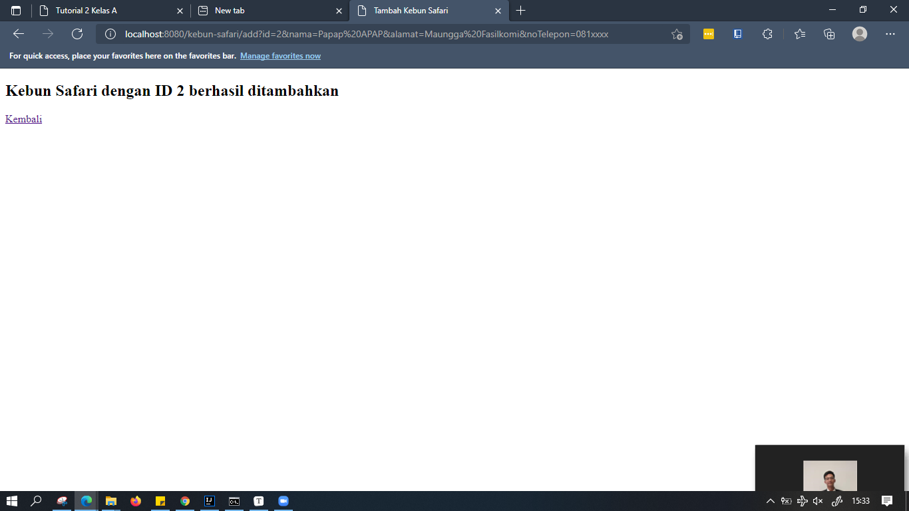
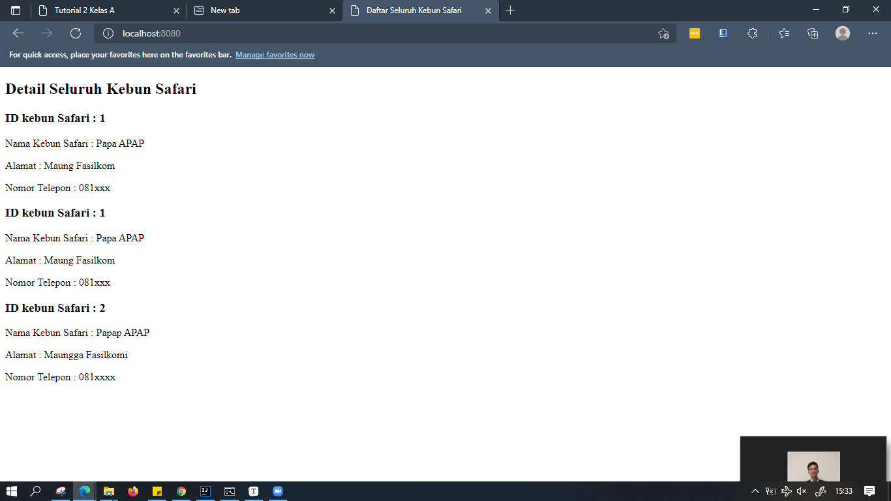

# Tutorial APAP
## Authors
* **Muhammad Ichsanul Amal** - *1906353454* - *A*

---

## Tutorial 3

**1. Tolong jelaskan secara singkat apa kegunaan dari anotasi-anotasi yang ada pada model (@AllArgsConstructor, @NoArgsConstructor, @Setter, @Getter, @Entity, @Table)**

@AllArgsConstructor untuk menambahkan constructor secara otomatis dari class berdasarkan semua argumen, @NoArgsConstructor untuk menambahkan constructor secara otomatis dari class tanpa argumen, @Setter untuk menambahkan setter secara otomatis dari class, @Getter untuk menambahkan getter secara otomatis dari class, @Entity untuk merelasikan class dengan entitas atau table pada database, dan @Table untuk men-set nama table pada entity yang terhubung dengan class.

**2. Pada class CabangDB, terdapat method findByNoCabang, apakah kegunaan dari method tersebut?**

Method tersebut merupakan fitur dari JPA Repository, fungsinya adalah memudahkan dalam pencarian ke database berdasarkan NoCabang yang mana NoCabang merupakan atribut dari Cabang.

**3. Jelaskan perbedaan kegunaan dari anotasi @JoinTable dan @JoinColumn**

@JoinTable menyimpan id dari kedua tabel ke dalam tabel baru terpisah, sedangkan @JoinColumn menyimpan id dari tabel lain di kolom baru, bukan pada tabel baru.

**4. Pada class PegawaiModel, digunakan anotasi @JoinColumn pada atribut cabang, apa kegunaan dari name, referencedColumnName, dan nullable dalam anotasi tersebut? dan apa perbedaan nullable dan penggunaan anotasi @NotNull**

`name` adalah kolom atribut pada PegawaiModel yang berelasi dengan Model lainnya, `referencedColumnName` adalah kolom pada Model lain yang berelasi dengan PegawaiModel, sedangkan `nullable` menyatakan boleh tidaknya null dalam suatu kolom, atau constraint null pada database. nullable lebih ditujukan untuk penggunaan database, sedangkan @NotNull adalah lebih umum untuk mengecek variabel atau hasil dari method tidak boleh null.

**5. Jelaskan kegunaan FetchType.LAZY, CascadeType.ALL, dan FetchType.EAGER**

FetchType.LAZY mengambil data dari database hanya saat dibutuhkan, CascadeType.ALL berarti semua persistensi akan menyebarkan (cascade) ke semua operasi EntityManager seperti PERSIST, REMOVE, REFRESH, MERGE, DETACH tanpa mengecek kondisi entitas yang berhubungan terlebih dahulu, sedangkan FetchType.EAGER mengambil data secara *immediate* atau langsung sekaligus.

## Tutorial 2

**Pertanyaan 1: Cobalah untuk menambahkan sebuah Kebun dengan mengakses link berikut setelah menjalankan program: http://localhost:8080/kebun-safari/add?id=1&nama=Papa%20APAP&alamat=Maung%20Fasilkom&noTelepon=081xxx Apa yang terjadi? Jelaskan mengapa hal tersebut dapat terjadi**

Terdapat Whitelabel Error Page karena pada Controller terdapat return  (“add-kebun-safari”), padahal file htmlnya belum dibuat.

**Pertanyaan 2: Menurut kamu anotasi @Autowired pada class Controller tersebut merupakan implementasi dari konsep apa? Dan jelaskan secara singkat cara kerja @Autowired tersebut dalam konteks service dan controller yang telah kamu buat**

Dependency injection. Spring akan mencari `KebunSafariService` dan implementasinya sesuai dengan nama atribut yang didefinisikan (dalam hal ini adalah `KebunSafariInMemoryService`), kemudian menginisiasi dan menginject dependency-nya. Dengan demikian, pada controller kita tidak perlu menginisiasinya secara manual dan bisa langsung menggunakan container tersebut.

**Pertanyaan 3: Cobalah untuk menambahkan sebuah Kebun dengan mengakses link berikut: http://localhost:8080/kebun-safari/add?id=1&nama=Papa%20APAP&alamat=Maung%20Fasilkom Apa yang terjadi? Jelaskan mengapa hal tersebut dapat terjadi.**

"*Required request parameter 'noTelepon' for method parameter type String is not present*" yang artinya client tidak memberikan parameter noTelepon, padahal di controller sudah diwajibkan untuk diisi.

**Pertanyaan 4: Jika Papa APAP ingin melihat Kebun Safari dengan nama Papa APAP, link apa yang harus diakses?**

Tidak bisa, detail kebun safari hanya bisa dicari menggunakan id nya saja.

**Pertanyaan 5: Tambahkan 1 contoh Kebun Safari lainnya sesukamu. Lalu cobalah untuk mengakses http://localhost:8080/ , apa yang akan ditampilkan? Sertakan juga bukti screenshotmu.**

Akan ditampilkan list dari kebun safari yang telah ditambahkan.

## Tutorial 1 

### What I have learned today 

### Github 

1. Apa itu Issue Tracker? Apa saja masalah yang dapat diselesaikan dengan Issue Tracker? (Tuliskan jawabanmu) 

   

   Issues Tracker merupakan fitur untuk tracking tasks, enhancements, dan bugs pada proyek yang dibuat. Masalah yang dapat diselesaikan adalah seputar dokumentasi, seperti isu yang sudah diselesaikan bisa diclose, dan yang masih dikerjakan dapat dijadikan prioritas. Selain itu, issue tracker juga memudahkan kolaborasi seperti untuk pull request, me-review commit, dan lain-lain.

   

2. Apa perbedaan dari git merge dan git merge --squash? 

   

   Pada git merge, semua commit yang ada pada branch yang melakukan pull request akan ditampilkan pada branch utama. Sedangkan "--squash" menjadikan commit yang ditambahkan pada branch utama menjadi hanya satu saja.

   

3. Apa keunggulan menggunakan Version Control System seperti Git dalam pengembangan suatu aplikasi? 

   

   VCS memudahkan proses pengembangan aplikasi agar setiap pihak yang ikut dalam pengembangan proyek bisa melihat dokumentasi real time dari pengembangannya. Apabila aplikasi terbaru yang dikembangkan kurang sesuai dengan yang diinginkan atau bahkan lebih buruk, pengembang dapat dengan mudah kembali ke versi sebelumnya untuk memperbaiki sesuai yang diinginkan seperti mesin waktu.

   

### Spring 

4. Apa itu library & dependency? 

   

   Library adalah sekumpulan package atau koleksi kelas yang telah disediakan oleh organisasi pengembang bahasa pemrograman untuk dapat digunakan oleh pengguna. Sedangkan dependency adalah ketergantungan antar kelas. Contoh dependency adalah saat ingin membuat program Java dengan konsep MVC, kita memerlukan framework seperti SpringBoot, yang artinya program yang kita buat dependent terhadap Spring Boot, atau Spring Boot merupakan dependency.

   

5. Apa itu Maven? Mengapa kita menggunakan Maven? Apakah ada alternatif dari Maven? 

   

   Apache Maven adalah Java Build Tools yang menggunakan konsep Project Object Model (POM). POM tersebut berisi informasi dan konfigurasi yang digunakan Maven untuk membuat project. Pada dasarnya POM adalah sebuath XML File yang terdapat di dalam project Maven dan di dalam File inilah konfigurasi dari project kita berada. Maven digunakan untuk mengkonfigurasi proyek java seperti untuk mengatur dependency, testing, dan lain-lain. Alternatif selain Maven adalah Gradle pada Java.

   

6. Selain untuk pengembangan web, apa saja yang bisa dikembangkan dengan Spring framework? 

   

   Spring dapat digunakan untuk membangun microservices, reactive, produk cloud, serverless, event-driven, dan batch. Selain itu, Spring juga dapat digunakan untuk:

   - Java Inversion of Control (IoC) Container atau disebut juga Dependency Injection
     Spring membantu pembuatan kontainer dalam menampung object-object yang memiliki ketergantungan pada object lain dalam melakukan transaksi. IoC berupa layer abstrak yang menampung object-object yang akan digunakan secara singleton (singleton adalah object yang dibuat sekali dan ditampung terus dalam memory selama aplikasi berjalan). Contoh object yang disimpan didalam IoC Container adalah SessionManager yang membuat koneksi dengan database. Contoh penggunaan objek SessionManager tersebut dalam IoC Container yaitu melakukan auto wire data injeksi object kedalam object yang akan melakukan transaksi dalam database.

   - Transaction Management
     Spring framework menyediakan sebuah layer abstrak yang generik untuk manajemen transaksi, sehingga memudahkan para developer dalam melakukan manajemen transaksi.
   - JDBC Exception Handling
     layer abstrak JDBC menawarkan exception yang bersifat hierarki sehingga memudahkan penanganan error.
   - Integrasi dengan hibernate, JDO, Email dan ibatis
   - Object-Relational-Mapping (ORM)Menggunakan Hibernate ORM.
     ORM adalah pola pemograman database tanpa harus berinteraksi langsung dengan bahasa SQL.

   

7. Apa perbedaan dari @RequestParam dan @PathVariable? Kapan sebaiknya menggunakan @RequestParam atau @PathVariable? 

   

   Perbedaan utama antara @RequestParam dan @PathVariable adalah bahwa @RequestParam digunakan untuk mengakses nilai parameter kueri sedangkan @PathVariable digunakan untuk mengakses nilai dari template URI. @RequestParam digunakan saat ingin mengambil nilai parameter permintaan dalam bentuk meneruskan parameter permintaan dengan url dan @PathVariable digunakan saat ingin mengambil nilai parameter dalam templat URI permintaan formulir dengan beberapa placeholder. Data yang dikirim melalui @RequestParam juga perlu diencode sehingga untuk mengirimkan informasi yang sensitif sebaiknya menggunakan anotasi ini, sedangkan pada @PathVariable lebih menampilkan informasi yang lebih general dan bisa dibookmark.

   

### What I did not understand 

(tuliskan apa saja yang kurang Anda mengerti, Anda dapat men-_check_ apabila Anda sudah mengerti dikemudian hari, dan tambahkan tulisan yang membuat Anda mengerti) 

- [x] Kenapa saya harus belajar APAP? Karena dengan APAP kita dapat mengerti bagaimana cara membangun aplikasi dengan skala besar yang fleksibel sesuai kebutuhan yang diinginkan.

